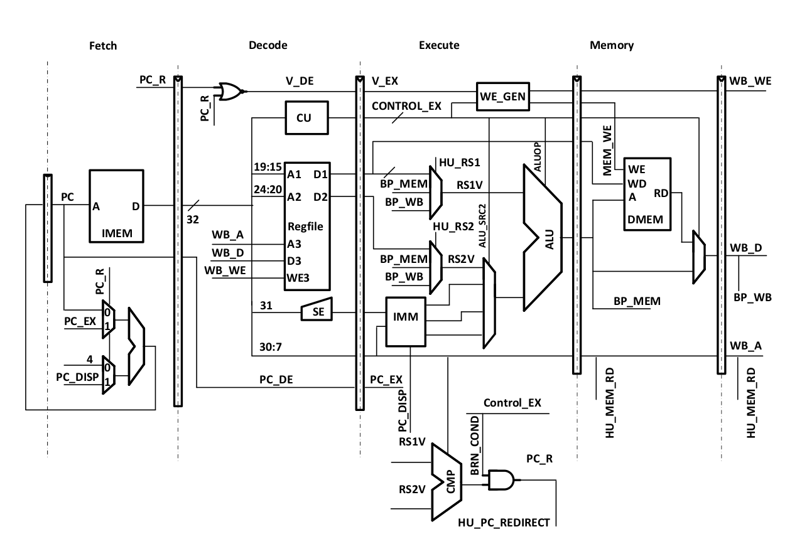

# RISC-V Pipeline Simulator 

Pipeline implementation of RV32I Base Instruction Set in appliance with [specification].

[specification]: https://en.wikipedia.org/wiki/LL_parser

## Pipeline scheme

